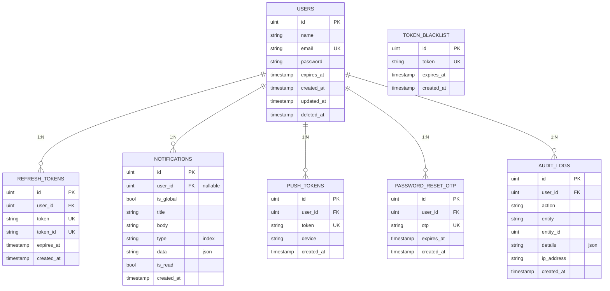
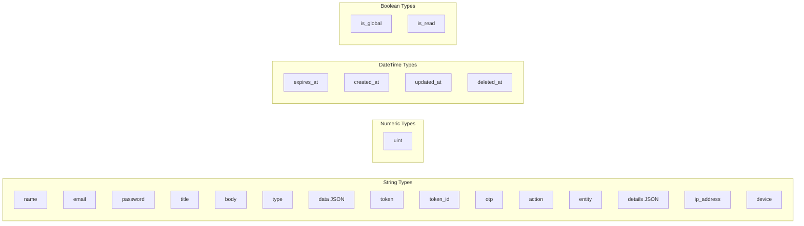

# Database ERD - REST API

## Entity Relationship Diagram



## Database Schema Overview

```mermaid
graph TB
    subgraph users["users"]
        direction TB
        U1[id]
        U2[name]
        U3[email]
        U4[password]
        U5[expires_at]
        U6[created_at]
    end

    subgraph notifications["notifications"]
        direction TB
        N1[id]
        N2[user_id FK]
        N3[is_global]
        N4[title]
        N5[body]
        N6[type]
        N7[data json]
        N8[is_read]
        N9[created_at]
    end

    subgraph push_tokens["push_tokens"]
        direction TB
        P1[id]
        P2[user_id FK]
        P3[token]
        P4[device]
        P5[created_at]
    end

    subgraph refresh_tokens["refresh_tokens"]
        direction TB
        R1[id]
        R2[user_id FK]
        R3[token]
        R4[token_id]
        R5[expires_at]
        R6[created_at]
    end
```



## Table Relationships Flow

```mermaid
flowchart TD
    subgraph Core["Core Tables"]
        Users[users]
    end

    subgraph Auth["Authentication"]
        RefreshTokens[refresh_tokens]
        TokenBlacklist[token_blacklist]
        PasswordReset[password_reset_otp]
    end

    subgraph Notifications["Notifications"]
        Notifications[notifications]
        PushTokens[push_tokens]
    end

    subgraph Logging["Logging & Audit"]
        AuditLogs[audit_logs]
    end

    Users -->|1:N| RefreshTokens
    Users -->|1:N| TokenBlacklist
    Users -->|1:N| PasswordReset
    Users -->|1:N| Notifications
    Users -->|1:N| PushTokens
    Users -->|1:N| AuditLogs
```

## Foreign Key Reference Table

| Table | Foreign Key | References | Relationship |
|-------|-------------|------------|--------------|
| `refresh_tokens` | `user_id` | `users.id` | Many-to-One |
| `notifications` | `user_id` | `users.id` | Many-to-One |
| `push_tokens` | `user_id` | `users.id` | Many-to-One |
| `password_reset_otp` | `user_id` | `users.id` | Many-to-One |
| `audit_logs` | `user_id` | `users.id` | Many-to-One |

## Indexes Summary

| Table | Index | Type |
|-------|-------|------|
| `users` | email | Unique |
| `refresh_tokens` | user_id | Index |
| `refresh_tokens` | token | Unique |
| `refresh_tokens` | token_id | Unique |
| `notifications` | user_id | Index |
| `notifications` | type | Index |
| `push_tokens` | user_id | Index |
| `push_tokens` | token | Unique |
| `token_blacklist` | token | Unique |
| `password_reset_otp` | user_id | Index |
| `password_reset_otp` | otp | Unique |
| `audit_logs` | user_id | Index |

## Data Types Summary

